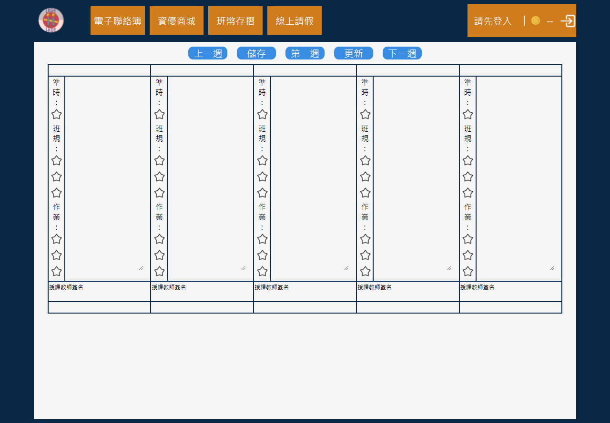

# 林小資優通-林口國小資優班網頁系統

## 連結
[https://dong-chen-1031.github.io/LKGE_WEEB/林小資優通](https://dong-chen-1031.github.io/LKGE_WEEB/林小資優通)

## 製作動機

資優班每堂課總是會花上很多時間在抄聯絡簿上，且普通的聯絡簿有很多問題，例如：課程太趕時會沒時間抄聯絡簿、計算資優班幣很容易算錯、老師改聯絡簿很麻煩……。

此外「新北校園通」APP已經數位化了原班聯絡簿（還很少學校使用），因此我要開發一套系統讓資優班課程變得更方便！

